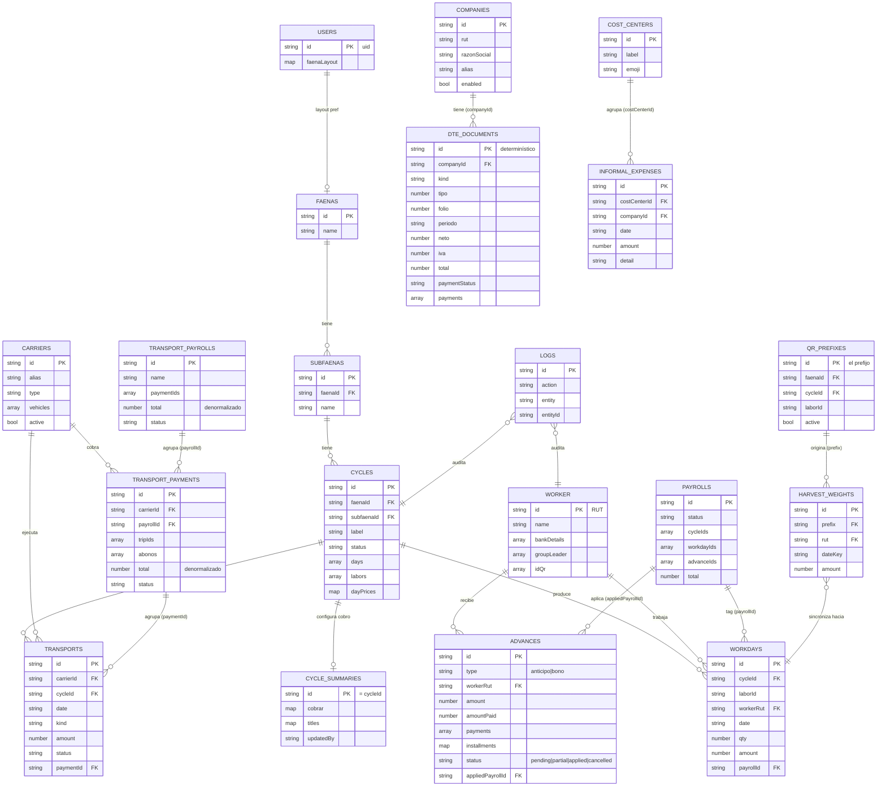

# Modelo de datos — Firestore (`hpdatabase`)

Sólo cabeceras de cada colección que la app está usando hoy. Tipos en notación informal: `string`, `number`, `bool`, `ts` (Timestamp), `ref→col` (id de doc en otra colección), `[]` (array), `{}` (objeto/map).

Convenciones comunes (todas las colecciones via `firestoreBase.createService`):
- `createdAt: ts`, `createdBy: string` (uid)
- `updatedAt: ts`, `updatedBy: string` (uid)

---

## Colecciones

### `faenas`
Lugar de trabajo (campo, predio).
| Campo | Tipo | Notas |
|---|---|---|
| `id` (docId) | string | autoId |
| `name` | string | |
| `notes` | string? | |

### `subfaenas`
Subdivisión dentro de una faena (cuartel, sector). Los ciclos siempre cuelgan de una.
| Campo | Tipo | Notas |
|---|---|---|
| `id` (docId) | string | autoId |
| `faenaId` | ref→`faenas` | |
| `name` | string | |
| `notes` | string? | |

### `cycles`
Período de trabajo en una subfaena. Contiene labores anidadas y la matriz de precios por día.
| Campo | Tipo | Notas |
|---|---|---|
| `id` (docId) | string | autoId |
| `faenaId` | ref→`faenas` | |
| `subfaenaId` | ref→`subfaenas` \| null | |
| `label` | string | prefijo + sufijo |
| `startDate` | string (YYYY-MM-DD) | |
| `status` | `"open"` \| `"closed"` | |
| `notes` | string? | |
| `days` | string[] | fechas YYYY-MM-DD |
| `labors` | `Labor[]` | embebido (ver abajo) |
| `dayPrices` | `{ [laborId]: { [date]: PriceEntry } }` | combos/tiers |
| `dayNotes` | `{ [date]: string }` | anotación compartida del día (click sobre el header) |

`Labor` (embebido en `cycles.labors`):
- `id`, `name`, `type` (`cosecha` \| `trato` \| `tratoHE` \| `main` \| `supervision` \| `extra`)
- `laborGroupId?: ref→laborGroups` — hila esta labor con las de mismo tipo en otros ciclos de la misma subfaena (ej. "Poda" del ciclo pasado con "Poda" del actual). Opcional, aditivo — `workdays`/`payroll` siguen usando `cycleId`+`laborId` (el id local del ciclo) igual que siempre; esto no lo reemplaza.
- `workers: WorkerEntry[]` — referencias al trabajador, no solo RUT:
  - `rut`, `name`
  - `isTemp?: bool` — trabajador temporal (sin RUT real); convertirlo via "Asignar RUT"
  - `groupLeader?: string` — solo para temps (los reales lo tienen en `worker.groupLeader`)
  - `monthly?: bool` — sueldo mensual: las celdas pasan a checkbox de asistencia, workdays con `amount: 0` y `attendanceOnly: true`, excluidos de la nómina, badge "M"
- `baseDayDefault?`, `bonusManejo?`, `bonusSupervision?`, `overtimeRate?`

### `laborGroups`
Agrupación de labores a través de ciclos, scoped a una subfaena (puede haber varias por subfaena: Poda, Riego, etc.). Renombrar el grupo no reescribe retroactivamente el `name` de las labores ya vinculadas — cada ciclo conserva el nombre que tenía al crearse.
| Campo | Tipo | Notas |
|---|---|---|
| `id` (docId) | string | autoId |
| `subfaenaId` | ref→`subfaenas` | |
| `name` | string | |
| `active` | bool | |

### `worker` (singular en Firestore)
Trabajador. **DocId = rut con el que se creó** (ej. `12345678-9`, `12345678-B`) — pero
desde la migración "rut editable" (fase 1) ese id se trata como un **`workerId`
estable**: nunca se vuelve a tocar aunque el rut legal cambie después (Firestore
no soporta rename de doc id). El rut ACTUAL vive en el campo `rut`, editable —
arranca igual al id pero puede divergir (típico: trabajador con cédula de
extranjería provisoria `-B`/`-H` que después obtiene rut definitivo). Todo lo
que necesite identidad estable (agrupar workdays, nóminas, auditoría) debe usar
el id/workerId, nunca el campo `rut`.
| Campo | Tipo | Notas |
|---|---|---|
| `id` (docId) | string | `workerId` estable — rut de creación, no cambia nunca |
| `rut` | string | rut legal ACTUAL, editable (campo agregado en fase 1; workers viejos necesitan backfill, ver AdminConsole → "Backfill: campo rut en trabajadores") |
| `name` | string | UPPERCASE típicamente |
| `email` | string? | |
| `bankDetails` | `[paymentRut, accountNumber, accountType, bankCode]` | tupla. accountType: 0 cta corriente, 1 cta vista, 3 cuenta RUT. bankCode `EFE` = efectivo. |
| `groupLeader` | string[] | historial; `[0]` = actual (ej. `CHILENOS`, `EXTRANJEROS`) |
| `idQr` | string[] | códigos QR asignados |

### `workdays`
Una fila por (cycleId × laborId × workerRut × date). Es la tabla "transaccional" de producción.
| Campo | Tipo | Notas |
|---|---|---|
| `id` (docId) | string | compuesto: `${cycleId}__${laborId}__${rut}__${date}[__${comboKey}]` (ver `utils/cosechaCombos.js` → `workdayDocId`). El segmento de rut queda congelado con el valor que tenía el worker AL CREAR el workday — no se reescribe si el trabajador edita su rut después. |
| `cycleId` | ref→`cycles` | |
| `laborId` | string | id dentro de `cycles.labors` |
| `workerRut` | string | rut del trabajador AL MOMENTO de crear/editar este workday — puede quedar desactualizado si el trabajador edita su rut después |
| `workerId` | ref→`worker` (por id, estable) | agregado en fase 2 de la migración "rut editable"; es la forma correcta de unir con el worker, no `workerRut`. Workdays viejos (pre-migración) no lo tienen — fallback a `workerRut` en ese caso |
| `date` | string (YYYY-MM-DD) | |
| `qty` | number? | kilos / cantidad |
| `qualityX`, `containerY` | number? | ejes del combo (cosecha) |
| `amount` | number | $ calculado |
| `payrollId` | ref→`payrolls` \| null | tag al liquidar |
| `payrollTaggedAt`, `payrollTaggedBy` | ts, string? | |
| `paidAt`, `paidBy` | ts?, string? | sello al marcar pagado |
| `attendanceOnly` | bool? | `true` para asistencia de trabajador mensual (amount = 0, no entra al payroll) |
| `tiers` | `{ [tierKey]: { qty, amount } }` | trato multi-precio; suma con `getTratoTierTotals(wd)` |
| `overtimeHours`, `hasManejo`, `hasSupervision`, `extras` | number? / bool? | solo `tratoHE` |
| `pisoOnly` | bool? | `true` para workdays de piso (combo `_piso`). `qty: 0`, `amount: pisoAmount`. Un doc por (worker × date × labor). Solo trato/cosecha. Tag con `payrollId` igual que cualquier otro workday. |

### `payrolls`
Nómina = lote de pago. Agrupa `workdayIds` y `advanceIds`.
| Campo | Tipo | Notas |
|---|---|---|
| `id` (docId) | string | autoId |
| `name` | string | |
| `format` | `"bchile"` | |
| `status` | `"pending"` \| `"paid"` | |
| `paidAt` | string (ISO) \| null | |
| `cycleIds` | string[] | refs a `cycles` |
| `cycleLabels`, `cycleDetails` | snapshot | |
| `items` | `PayrollItem[]` | snapshot por trabajador |
| `total`, `bankTotal`, `cashTotal` | number | |
| `workerCount`, `bankCount`, `cashCount` | number | |
| `workdayIds` | ref→`workdays`[] | |
| `advanceIds` | ref→`advances`[] | |
| `advanceTotal` | number | |

`PayrollItem` (embebido):
- `rut` (el campo real en código es `rut`, no `workerRut` a pesar de lo que sugiere el nombre del doc — mismatch histórico), `workerId` (agregado en fase 2, ref estable al worker), `workerName`, `bankDetails`
- `amount`, `advance`, `anticiposTotal`, `adelantosTotal` (**legacy: siempre 0** de acá en adelante; se sigue escribiendo solo para que los snapshots viejos se lean igual)
- `byCycle: { [cycleId]: {...} }`
- `workdayIds: string[]`, `advanceIds: string[]`

### `payrollSnapshots`
Snapshot JSON inmutable de cada nómina, separado del documento de `payrolls` para no engordar la lista. Lo escribe la app al generar la nómina y lo consume el **portal de trabajadores** (read-only) para construir su resumen.
| Campo | Tipo | Notas |
|---|---|---|
| `id` (docId) | string | mismo id de la `payroll` (1:1) |
| `payrollId` | ref→`payrolls` | |
| `generatedAt` | string (ISO) | |
| `name`, `format`, `status` | string | snapshot de la payroll |
| `cycleIds`, `cycleLabels`, `cycleDetails` | snapshot | |
| `items` | `PayrollItem[]` | trabajadores + amounts (mismo shape que `payrolls.items`) |
| `total`, `bankTotal`, `cashTotal`, `advanceTotal` | number | |
| `workerCount`, `bankCount`, `cashCount` | number | |

> Se descarga como `.json` al generar y se puede volver a bajar desde la fila del historial ("📥 JSON").

### `interestLinks`
Atajos a herramientas externas mostrados en `/links`. CRUD con reordenamiento drag-and-drop.
| Campo | Tipo | Notas |
|---|---|---|
| `id` (docId) | string | autoId |
| `text` | string | etiqueta visible |
| `url` | string | URL normalizada (`https://...`) |
| `order` | number? | índice ascendente; sin valor → ordena al final alfabéticamente |

### `advances`
Anticipos (descuento) y bonos (suma) sobre la próxima nómina. El signo lo da `type`, no el monto: `amount` siempre es positivo.
| Campo | Tipo | Notas |
|---|---|---|
| `id` (docId) | string | autoId |
| `type` | `"anticipo"` \| `"bono"` | `anticipo` descuenta (sign −1), `bono` suma (+1). El legacy `"adelanto"` se normaliza a `"anticipo"` **al leer** (`normalizeAdvanceType`) — los docs viejos conservan ese valor en Firestore, no hubo backfill |
| `workerRut` | string | rut al momento de crear el anticipo |
| `workerId` | ref→`worker` (por id, estable) | agregado en fase 2; fallback a `workerRut` en anticipos viejos |
| `workerName` | string | snapshot |
| `amount` | number | total comprometido |
| `amountPaid` | number | denormalizado = Σ `payments[].amount`; el saldo es `advanceRemaining() = amount − amountPaid` |
| `payments` | `[{ payrollId, amount, paidAt }]` | append-only. **No queda ordenado por fecha**: revertir una nómina filtra entradas del medio (`restoreAdvancesFromPayroll`), así que para "última cuota" hay que tomar el MÁXIMO `paidAt`, nunca el último elemento |
| `date` | string (YYYY-MM-DD) | |
| `note` | string? | |
| `status` | `"pending"` \| `"partial"` \| `"applied"` \| `"cancelled"` | `partial` = `amountPaid > 0` pero menor a `amount`; sigue siendo cobrable. Los docs legacy sin `status` se tratan como `pending` |
| `installments` | `{ count, amount, cadence }` \| null | plan de cuotas, **solo para `anticipo`**. Se fija al crear y no se edita después (para cambiarlo hay que borrar y recrear). `amount = Math.ceil(total/count)` — ceil a propósito: `count` cuotas siempre cubren el total y la última queda más chica sola, sin llevar la cuenta de en qué cuota va. `cadence` (`porPago` \| `quincenal` \| `mensual`) es una **etiqueta informativa, no un gate por fecha**: no hay cron en la app, el admin confirma a mano qué cuotas entran al generar cada nómina |
| `appliedPayrollId` | ref→`payrolls` \| null | última nómina que lo tocó (legacy — el detalle real vive en `payments[]`) |
| `appliedAt`, `appliedBy` | ts?, string? | |

> **Ojo con los filtros**: `pending` y `partial` van juntos en el bucket "Pendientes" (`Advances.jsx` → `STATUS_BUCKET`, y `listPendingForWorkers()`). Un parcial que quede fuera de ese bucket desaparece de la vista sin que su saldo deje de existir.

### `carriers`
Transportistas (propios o contratados).
| Campo | Tipo | Notas |
|---|---|---|
| `id` (docId) | string | autoId |
| `alias`, `name` | string | |
| `type` | `"own"` \| `"contracted"` | |
| `defaultRate` | number | |
| `vehicles` | `[{alias, plate?, capacity?, notes?}]` | |
| `notes` | string? | |
| `active` | bool | soft delete |

### `transports` (vueltas / viajes)
| Campo | Tipo | Notas |
|---|---|---|
| `id` (docId) | string | autoId |
| `carrierId` | ref→`carriers` | |
| `vehicleAlias` | string | |
| `cycleId` | ref→`cycles` | |
| `faenaId`, `subfaenaId` | ref \| null | |
| ~~`laborId`~~ | — | **No llega a Firestore.** `TripEditModal` lo pide y lo manda en el payload, pero `normalizeTrip()` (transportsService.js) no lo copia al doc, así que nunca se escribe ni lo lee nadie. Hoy es una entrada de usuario que se descarta en silencio: o se saca del form, o se agrega a `normalizeTrip`. |
| `date` | string (YYYY-MM-DD) | |
| `kind` | `"regular"` \| `"approach"` | |
| `qty`, `rate`, `amount` | number | `amount = qty * rate` |
| `lugar`, `destino` | string? | |
| `personCount` | number? | |
| `notes` | string? | |
| `status` | `"pending"` \| `"paid"` | una vuelta `paid` queda congelada: `tripsService.update`/`remove` la rechazan |
| `paymentId` | ref→`transportPayments` \| null | null = "vuelta suelta", disponible para entrar a un resumen nuevo |

### `transportPayments`
Resumen de pago a un transportista (lote de `transports`).
| Campo | Tipo | Notas |
|---|---|---|
| `id` (docId) | string | autoId |
| `carrierId` | ref→`carriers` | |
| `periodFrom`, `periodTo` | string (YYYY-MM-DD) \| null | **snapshot del rango con que se creó el resumen**; no se recalcula al agregarle vueltas después, así que puede quedar más angosto que las fechas reales de `tripIds` |
| `groupBy` | `"day"` \| ... | |
| `tripIds` | ref→`transports`[] | |
| `total` | number | **denormalizado** = Σ `amount` de las vueltas vivas. Lo mantiene el servicio (`recalcPaymentTotal`), no las pantallas — ver "Totales denormalizados" abajo |
| `abonos` | `[{ id, amount, date, notes, createdAt, createdBy }]` | pagos parciales antes de marcar el resumen 100% pagado. El pendiente se calcula en cliente (`total − Σ abonos`); **no** descuenta de `total` |
| `payrollId` | ref→`transportPayrolls` \| null | null = resumen "suelto", disponible para entrar a una quincena |
| `status` | `"pending"` \| `"paid"` | `paid` congela el doc: no se recalcula ni se edita |
| `paidAt`, `paidBy` | ts?, string? | |
| `notes` | string? | |

### `transportPayrolls` (quincenas)
Agrupa N `transportPayments` de **varios** transportistas para pagar en bloque. Relación 1:N estricta: un resumen pertenece a una quincena o a ninguna.
| Campo | Tipo | Notas |
|---|---|---|
| `id` (docId) | string | autoId |
| `name` | string | obligatorio (ej. "Primera Quincena Agosto") |
| `periodFrom`, `periodTo` | string (YYYY-MM-DD) \| null | referencial: el agrupamiento es lógico, no un filtro estricto por fecha |
| `paymentIds` | ref→`transportPayments`[] | |
| `total` | number | **denormalizado** = Σ `total` de sus resúmenes (`recalcPayrollTotal`) |
| `status` | `"pending"` \| `"paid"` | |
| `paidAt`, `paidBy` | ts?, string? | |
| `notes` | string? | |

> **Cascada de pago**: marcar la quincena pagada marca cada resumen y cada vuelta de cada resumen. Marcar un item suelto marca solo ese resumen y sus vueltas — la quincena sigue `pending` hasta que se marque explícitamente. Revertir hace la cascada inversa.

### `companies`
Empresas (emisoras/receptoras) del módulo de Facturación. Multi-empresa: el usuario elige cuál opera y se persiste en `localStorage`.
| Campo | Tipo | Notas |
|---|---|---|
| `id` (docId) | string | autoId |
| `rut` | string | normalizado `"76123456-7"` (`normalizeRut`) |
| `razonSocial` | string | |
| `alias` | string | display; default = `razonSocial` |
| `enabled` | bool | |

### `dteDocuments`
Documento tributario electrónico (factura / boleta / NC / etc.) importado del **RCV del SII**. **DocId determinístico** (`buildDteDocId`) para que reimportar el mismo período sea idempotente:
- ventas: `{companyId}_V_{tipo}_{folio}`
- compras: `{companyId}_C_{rutProveedorNumérico}_{tipo}_{folio}`

| Campo | Tipo | Notas |
|---|---|---|
| `id` (docId) | string | determinístico (ver arriba) |
| `companyId` | ref→`companies` | empresa dueña |
| `companyAlias` | string | snapshot |
| `kind` | `"venta"` \| `"compra"` | detectado del header del CSV |
| `tipo` | number | código DTE del SII (33, 34, 61, 112, …) |
| `tipoLabel` | string | label legible (`dteTypeLabel`) |
| `folio` | number | |
| `fechaEmision` | string (YYYY-MM-DD) | |
| `periodo` | string (YYYY-MM) | derivado de `fechaEmision`; clave de filtro/agrupación (incl. tab Resumen) |
| `rutEmisor`, `razonSocialEmisor` | string | en ventas el emisor somos nosotros |
| `rutReceptor`, `razonSocialReceptor` | string | en compras el receptor somos nosotros |
| `exento`, `neto`, `iva`, `otrosImpuestos`, `total` | number | montos. **NCs (61/112) restan con signo** en los totales de la UI |
| `otroImpuestoCodigo` | number? | "Código Otro Impuesto" del RCV (**28/35/271/272 = combustible**) |
| `otroImpuestoCategory` | string? | `combustible` \| `alcohol` \| `tabaco` \| `bebidas` \| `otros` |
| `source` | `"sii_import"` | |
| `sourceFile` | string | filename original del CSV |
| `paymentStatus` | `"unpaid"`\|`"paid"`\|`"net_only"`\|`"factored"`\|`"cancelled"` | default `unpaid` al importar; **preservado al reimportar** |
| `amountPaid` | number | denormalizado = `Σ payments[].amount` |
| `payments` | `Payment[]` | abonos (ver abajo) |
| `notes` | string? | notas editables / auditoría de anulación por NC |
| `importedAt`, `importedBy` | ts, string? | sello del import (writeBatch chunks de 450) |

`Payment` (embebido en `dteDocuments.payments`):
- `id` (local), `date` (YYYY-MM-DD), `kind` (`abono` \| `neto` \| `iva` \| `total`), `amount: number`, `notes: string`
- **Invariante**: `Σ amount ≤ total` (validado al guardar).

### `costCenters`
Centros de costo **ficticios** del Libro de Facturación — catálogo global (compartido entre empresas) para etiquetar a mano documentos que no calzan con la agrupación por proveedor (ej. "Arriendo", "Mantención"). "Combustibles" no vive acá: se deriva 100% del código de otro impuesto del SII.
| Campo | Tipo | Notas |
|---|---|---|
| `id` (docId) | string | autoId |
| `label` | string | |
| `emoji` | string \| null | |

### `informalExpenses`
Gastos sin respaldo tributario (sin factura/boleta, o con boleta nunca ingresada al SII). **Puramente informativos**: no son `dteDocuments`, no se mezclan con la data fiscal y solo se muestran dentro de la vista de un centro de costo.
| Campo | Tipo | Notas |
|---|---|---|
| `id` (docId) | string | autoId |
| `costCenterId` | ref→`costCenters` | |
| `companyId` | ref→`companies` \| null | opcional: gasto sin empresa asignada |
| `date` | string (YYYY-MM-DD) | |
| `amount` | number | |
| `detail` | string | |

### `groupLeader`
Listado curado de líderes de grupo disponibles para asignación. La idea es que la lista no crezca con valores ad-hoc.
| Campo | Tipo | Notas |
|---|---|---|
| `id` (docId) | string | autoId o nombre |
| `name` | string | nombre del líder (defensivo: también acepta `nombre` o el docId) |
| `habilitado` | bool | `true` = aparece en el picker; `false` = grupo inactivo, no se sugiere |

### `catalogs`
Listas configurables. **DocId = nombre del catálogo** (`qualities`, `containers`, `tratoTypes`).
| Campo | Tipo | Notas |
|---|---|---|
| `id` (docId) | string | nombre |
| `entries` | `[{ value, label }]` | |

### `contactCards`
Libreta compartida de contactos (persona o empresa) con datos bancarios listos para copiar — pantalla "Información y Cuentas". Modelo **independiente**: no se vincula a `worker` ni a `companies`.
| Campo | Tipo | Notas |
|---|---|---|
| `id` (docId) | string | autoId |
| `type` | `"persona"` \| `"empresa"` | |
| `name` | string | |
| `rut` | string | normalizado |
| `includeRut` | bool | si el RUT se muestra/copia junto con los datos (siempre `true` en empresas) |
| `phone`, `email`, `address` | string | |
| `giro` | string | solo `empresa` |
| `note` | string | |
| `favorite` | bool | fija la ficha arriba |
| `accounts` | `Account[]` | N cuentas por ficha (ver abajo) |

`Account` (embebido en `contactCards.accounts`):
- `id` (local), `label`, `titular`, `rutTitular`
- `bankCode`, `accountType` (number, misma convención que `worker.bankDetails`), `accountNumber`, `email`

### `indicators`
Valores del ticker del header (sueldo base, valor día, valor hora extra). **Un único doc `indicators/main`**, editado a mano desde el header.
| Campo | Tipo | Notas |
|---|---|---|
| `id` (docId) | string | siempre `"main"` |
| `sueldoBase`, `dia`, `hora` | number | |

### `priceBookEntries`
Libro de precios: registro contable **independiente** de faenas/labores/ciclos (histórico, incluye faenas "dummy" que no existen en `faenas`). No alimenta ni depende de `cycles`/`workdays`.
| Campo | Tipo | Notas |
|---|---|---|
| `id` (docId) | string | autoId |
| `faenaId` | ref→`faenas` \| null | null cuando la faena es dummy (solo texto) |
| `faenaLabel` | string | snapshot del nombre, real o dummy |
| `labor` | string | texto libre, no ref |
| `prices` | `PriceLine[]` | ver abajo |
| `transportIncluded` | bool | |
| `transportWhere` | string \| null | solo si el transporte **no** está incluido |
| `transportCost` | number \| null | ídem |
| `dateFrom` | string (YYYY-MM-DD) | |
| `dateTo` | string (YYYY-MM-DD) \| null | null = vigente |
| `periodNote`, `notes` | string \| null | |

`PriceLine` (embebido en `priceBookEntries.prices`):
- `unit` (texto libre; el catálogo de unidades se acumula en `priceBookConfig/main`), `label`
- `payPrice` (lo que se paga), `chargePrice` (lo que se cobra)
- `hasOvertime`, `overtimePayPrice`, `overtimeChargePrice` — solo para unidades de jornada

### `priceBookConfig`
Config chica y compartida del libro de precios. **Un único doc `priceBookConfig/main`**, mismo patrón que `indicators/main`.
| Campo | Tipo | Notas |
|---|---|---|
| `id` (docId) | string | siempre `"main"` |
| `units` | string[] | catálogo de unidades; crece solo al escribir una unidad nueva en una entrada |
| `hiddenFaenaIds` | string[] | faenas reales que se esconden del selector (nombre no legible) |

### `harvestWeights`
Pesajes de cosecha escaneados por QR, escritos por la **app externa de scan**. Colección plana tipo log de eventos (N por trabajador por día). Es fuente de verdad: la app admin **nunca la edita**, solo la lee para sincronizar hacia `workdays`.
| Campo | Tipo | Notas |
|---|---|---|
| `id` (docId) | string | autoId (lo pone la app de scan) |
| `prefix` | ref→`qrPrefixes` | prefijo del QR físico que originó el pesaje |
| `rut` | string | trabajador |
| `dateKey` | string (YYYY-MM-DD) | clave de agrupación y de filtro por rango |
| `amount` | number | kilos del pesaje |
| `weightProcess` | number | eje "calidad" en la convención numérica del scan; se mapea vía `qrPrefixes.qualityMap` |
| `weightType` | number | eje "envase"; se mapea vía `qrPrefixes.containerMap` |

### `qrPrefixes`
Puente entre un prefijo de QR físico y el (faena, ciclo, labor) al que hay que sincronizar sus pesajes. **DocId = el prefijo** (ej. `"HP"`). El ciclo/labor vigente se reapunta a mano cada vez que se abre un ciclo nuevo — deliberadamente semi-manual.
| Campo | Tipo | Notas |
|---|---|---|
| `id` (docId) | string | el prefijo, UPPERCASE |
| `label` | string | |
| `faenaId` | ref→`faenas` | |
| `cycleId` | ref→`cycles` \| null | ciclo vigente al que se sincroniza |
| `laborId` | string \| null | labor (de tipo cosecha) dentro de ese ciclo |
| `qualityMap`, `containerMap` | `{ [codigoScan]: valorCatalogo }`? | remapeo opcional; sin ellos el mapeo es identidad |
| `active` | bool | |

### `cycleSummaries`
Estado editable del "Resumen ciclo" en modo **Cobrar**: tarifas de cobro, overrides por fila, filas manuales, descuento/saldo, columnas ocultas y títulos personalizados. **DocId = cycleId.** Antes vivía en `localStorage` por navegador (`cobrar_${cycleId}` / `summary_titles_${cycleId}`); ahora es compartido entre usuarios, y localStorage quedó como espejo local y origen de la migración automática al abrir un ciclo que se configuró antes del cambio.

Colección aparte y no un campo en `cycles` porque los docs de `cycles` se traen enteros en los listados y este blob (overrides por labor × fecha) pesa varios KB por ciclo.

| Campo | Tipo | Notas |
|---|---|---|
| `id` (docId) | ref→`cycles` | el cycleId |
| `cobrar` | object | `{ labors, carriers, withIva, discount, discountNote, pendingBalance, pendingBalanceNote, hiddenColumns }` — ver `labors[laborId].rowOverrides/extraRows` en AGENTS.md |
| `titles` | object | `{ main, subtitle, laborNames, carrierNames }` |
| `updatedAt` | timestamp | escrito con `serverTimestamp()` en cada guardado debounced |
| `updatedBy`, `updatedByEmail` | string \| null | quién lo tocó al final; se muestra en el header del modal |

> Sin `logs` de auditoría: el guardado es debounced mientras se tipea, así que registrar cada escritura llenaría el log de diffs anidados. La trazabilidad acá es `updatedBy`/`updatedAt`. Por eso el servicio (`src/services/cycleSummariesService.js`) está escrito a mano y no con `createService()`.

### `users`
Preferencias de UI por usuario. **DocId = uid de Auth.**
| Campo | Tipo | Notas |
|---|---|---|
| `id` (docId) | string | uid |
| `faenaLayout` | `{ groups, faenaGroup, faenaColor }` | layout de la pantalla Faenas |
| `faenaLayoutUpdatedAt` | ts | |

### `logs`
Auditoría — una fila por mutación.
| Campo | Tipo | Notas |
|---|---|---|
| `id` (docId) | string | autoId |
| `uid`, `email` | string? | quién |
| `action` | `"create"` \| `"update"` \| `"delete"` | |
| `entity`, `entityId` | string | qué |
| `before` | objeto? | solo en `delete` (snapshot completo) |
| `after` | objeto? | solo en `create` (snapshot completo) |
| `changes` | `{ [campo]: { from, to } }`? | solo en `update` — **es el diff, no el doc entero** |
| `meta` | objeto? | referencias cruzadas denormalizadas + contexto extra (ver abajo) |
| `timestamp` | ts | |

`meta` es lo que hace buscable un log de `update`: como esos logs guardan solo el diff, sin denormalizar el "dueño" no hay forma de preguntar "qué le pasó a las cosas de este trabajador/transportista".
| Clave | La escribe | Para |
|---|---|---|
| `workerRut`, `cycleId` | `firestoreBase.js` → `extractRefMeta` (automático en cualquier colección que tenga esos campos) | ligar `workdays` y demás a su trabajador/ciclo |
| `carrierId` | `transportsService.js` → `carrierMeta()` (a mano: ese servicio no usa `createService`) | ligar `transport` y `transportPayment` a su transportista |
| `auto: "recalcTotal"` | `recalcPaymentTotal` / `recalcPayrollTotal` | distinguir un recálculo automático de total de una edición hecha por una persona |
| `addedAbono`, `removedAbonoId` | `paymentsService` | detalle del abono tocado |

> Consumidor: `Audit.jsx` → `fetchSatelliteLogs`. Al elegir un registro en "Buscar por registro" suma los logs satélite (trabajador → sus jornadas; transportista → sus vueltas y resúmenes). **La atribución por `meta.carrierId` es reciente: los logs de transporte anteriores no la tienen y no aparecen ahí.**

---

## Diagrama (Mermaid)

> El diagrama se renderiza en VSCode (con extensión "Markdown Preview Mermaid") y en GitHub.

---

## Relaciones clave (texto)

- **faena → subfaena → cycle**: jerarquía estricta. Un ciclo siempre tiene `subfaenaId`.
- **cycle.labors[].workers[]**: array de RUTs (no es FK formal, pero apunta a `worker.id`).
- **workday.payrollId**: tag inverso. Una nómina "reclama" sus workdays vía `workdayIds[]` y a la vez cada workday queda apuntando a la nómina.
- **advance.status / appliedPayrollId**: paralelo al de workdays — se "aplican" a una nómina y se "restauran" a `pending` si la nómina se borra.
- **transport.paymentId ↔ transportPayment.tripIds**: misma idea de tag bidireccional para transportistas. Lo mismo un nivel más arriba con **transportPayment.payrollId ↔ transportPayroll.paymentIds**.
- **Totales denormalizados (transporte)**: `transportPayments.total` y `transportPayrolls.total` son sumas guardadas, no calculadas al leer. El detalle imprimible suma las vueltas **en vivo**, mientras que el Balance de quincenas y la tarjeta de la quincena leen el campo — si divergen, es que algo escribió una vuelta sin propagar hacia arriba. La propagación vive en `transportsService.js` (`recalcPaymentTotal` → `recalcPayrollTotal`), disparada desde `tripsService.create/update/remove`, **no en las pantallas**. Los docs con `status: "paid"` quedan congelados y no se recalculan.
- **advance.amountPaid ↔ advance.payments[]**: `amountPaid` es la suma de `payments[]` y el `status` se deriva de comparar contra `amount`. Revertir una nómina filtra de `payments[]` las entradas de esa nómina y recalcula ambos — por eso el array no queda ordenado por fecha.
- **qrPrefix → harvestWeights → workdays**: los pesajes los escribe una app externa contra un prefijo de QR; el prefijo dice a qué (ciclo, labor) sincronizarlos. La sincronización agrupa por (trabajador, día, combo) y escribe/actualiza `workdays` — es un flujo de una sola dirección, la app admin nunca escribe `harvestWeights`.
- **costCenter → informalExpenses**: gastos sin respaldo tributario, deliberadamente separados de `dteDocuments` para no contaminar la data fiscal.
- **company → dteDocuments** (`companyId`): los DTE cuelgan de una empresa. El docId es **determinístico** (no autoId) → reimportar el mismo período es idempotente; el "replace por período" borra huérfanos y preserva `paymentStatus`/`payments` existentes.
- **catalogs / users**: docIds estables (nombre / uid), no autoId.
