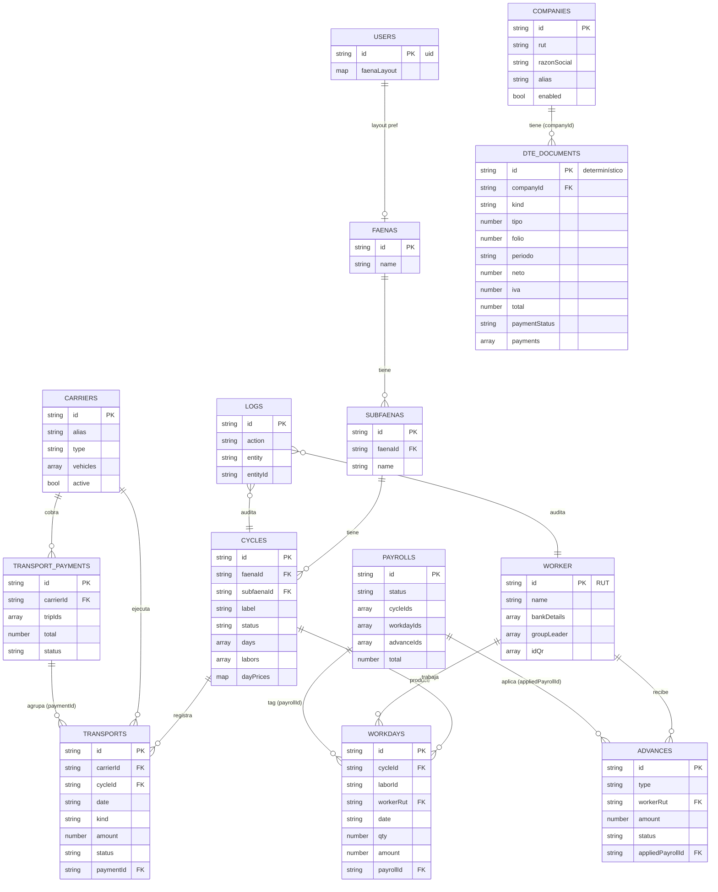

# Modelo de datos — Firestore (`hpdatabase`)

Sólo cabeceras de cada colección que la app está usando hoy. Tipos en notación informal: `string`, `number`, `bool`, `ts` (Timestamp), `ref→col` (id de doc en otra colección), `[]` (array), `{}` (objeto/map).

Convenciones comunes (todas las colecciones via `firestoreBase.createService`):
- `createdAt: ts`, `createdBy: string` (uid)
- `updatedAt: ts`, `updatedBy: string` (uid)

---

## Colecciones

### `faenas`
Lugar de trabajo (campo, predio).
| Campo | Tipo | Notas |
|---|---|---|
| `id` (docId) | string | autoId |
| `name` | string | |
| `notes` | string? | |

### `subfaenas`
Subdivisión dentro de una faena (cuartel, sector). Los ciclos siempre cuelgan de una.
| Campo | Tipo | Notas |
|---|---|---|
| `id` (docId) | string | autoId |
| `faenaId` | ref→`faenas` | |
| `name` | string | |
| `notes` | string? | |

### `cycles`
Período de trabajo en una subfaena. Contiene labores anidadas y la matriz de precios por día.
| Campo | Tipo | Notas |
|---|---|---|
| `id` (docId) | string | autoId |
| `faenaId` | ref→`faenas` | |
| `subfaenaId` | ref→`subfaenas` \| null | |
| `label` | string | prefijo + sufijo |
| `startDate` | string (YYYY-MM-DD) | |
| `status` | `"open"` \| `"closed"` | |
| `notes` | string? | |
| `days` | string[] | fechas YYYY-MM-DD |
| `labors` | `Labor[]` | embebido (ver abajo) |
| `dayPrices` | `{ [laborId]: { [date]: PriceEntry } }` | combos/tiers |
| `dayNotes` | `{ [date]: string }` | anotación compartida del día (click sobre el header) |

`Labor` (embebido en `cycles.labors`):
- `id`, `name`, `type` (`cosecha` \| `trato` \| `tratoHE` \| `main` \| `supervision` \| `extra`)
- `laborGroupId?: ref→laborGroups` — hila esta labor con las de mismo tipo en otros ciclos de la misma subfaena (ej. "Poda" del ciclo pasado con "Poda" del actual). Opcional, aditivo — `workdays`/`payroll` siguen usando `cycleId`+`laborId` (el id local del ciclo) igual que siempre; esto no lo reemplaza.
- `workers: WorkerEntry[]` — referencias al trabajador, no solo RUT:
  - `rut`, `name`
  - `isTemp?: bool` — trabajador temporal (sin RUT real); convertirlo via "Asignar RUT"
  - `groupLeader?: string` — solo para temps (los reales lo tienen en `worker.groupLeader`)
  - `monthly?: bool` — sueldo mensual: las celdas pasan a checkbox de asistencia, workdays con `amount: 0` y `attendanceOnly: true`, excluidos de la nómina, badge "M"
- `baseDayDefault?`, `bonusManejo?`, `bonusSupervision?`, `overtimeRate?`

### `laborGroups`
Agrupación de labores a través de ciclos, scoped a una subfaena (puede haber varias por subfaena: Poda, Riego, etc.). Renombrar el grupo no reescribe retroactivamente el `name` de las labores ya vinculadas — cada ciclo conserva el nombre que tenía al crearse.
| Campo | Tipo | Notas |
|---|---|---|
| `id` (docId) | string | autoId |
| `subfaenaId` | ref→`subfaenas` | |
| `name` | string | |
| `active` | bool | |

### `worker` (singular en Firestore)
Trabajador. **DocId = rut con el que se creó** (ej. `12345678-9`, `12345678-B`) — pero
desde la migración "rut editable" (fase 1) ese id se trata como un **`workerId`
estable**: nunca se vuelve a tocar aunque el rut legal cambie después (Firestore
no soporta rename de doc id). El rut ACTUAL vive en el campo `rut`, editable —
arranca igual al id pero puede divergir (típico: trabajador con cédula de
extranjería provisoria `-B`/`-H` que después obtiene rut definitivo). Todo lo
que necesite identidad estable (agrupar workdays, nóminas, auditoría) debe usar
el id/workerId, nunca el campo `rut`.
| Campo | Tipo | Notas |
|---|---|---|
| `id` (docId) | string | `workerId` estable — rut de creación, no cambia nunca |
| `rut` | string | rut legal ACTUAL, editable (campo agregado en fase 1; workers viejos necesitan backfill, ver AdminConsole → "Backfill: campo rut en trabajadores") |
| `name` | string | UPPERCASE típicamente |
| `email` | string? | |
| `bankDetails` | `[paymentRut, accountNumber, accountType, bankCode]` | tupla. accountType: 0 cta corriente, 1 cta vista, 3 cuenta RUT. bankCode `EFE` = efectivo. |
| `groupLeader` | string[] | historial; `[0]` = actual (ej. `CHILENOS`, `EXTRANJEROS`) |
| `idQr` | string[] | códigos QR asignados |

### `workdays`
Una fila por (cycleId × laborId × workerRut × date). Es la tabla "transaccional" de producción.
| Campo | Tipo | Notas |
|---|---|---|
| `id` (docId) | string | compuesto: `${cycleId}__${laborId}__${rut}__${date}[__${comboKey}]` (ver `utils/cosechaCombos.js` → `workdayDocId`). El segmento de rut queda congelado con el valor que tenía el worker AL CREAR el workday — no se reescribe si el trabajador edita su rut después. |
| `cycleId` | ref→`cycles` | |
| `laborId` | string | id dentro de `cycles.labors` |
| `workerRut` | string | rut del trabajador AL MOMENTO de crear/editar este workday — puede quedar desactualizado si el trabajador edita su rut después |
| `workerId` | ref→`worker` (por id, estable) | agregado en fase 2 de la migración "rut editable"; es la forma correcta de unir con el worker, no `workerRut`. Workdays viejos (pre-migración) no lo tienen — fallback a `workerRut` en ese caso |
| `date` | string (YYYY-MM-DD) | |
| `qty` | number? | kilos / cantidad |
| `qualityX`, `containerY` | number? | ejes del combo (cosecha) |
| `amount` | number | $ calculado |
| `payrollId` | ref→`payrolls` \| null | tag al liquidar |
| `payrollTaggedAt`, `payrollTaggedBy` | ts, string? | |
| `paidAt`, `paidBy` | ts?, string? | sello al marcar pagado |
| `attendanceOnly` | bool? | `true` para asistencia de trabajador mensual (amount = 0, no entra al payroll) |
| `tiers` | `{ [tierKey]: { qty, amount } }` | trato multi-precio; suma con `getTratoTierTotals(wd)` |
| `overtimeHours`, `hasManejo`, `hasSupervision`, `extras` | number? / bool? | solo `tratoHE` |
| `pisoOnly` | bool? | `true` para workdays de piso (combo `_piso`). `qty: 0`, `amount: pisoAmount`. Un doc por (worker × date × labor). Solo trato/cosecha. Tag con `payrollId` igual que cualquier otro workday. |

### `payrolls`
Nómina = lote de pago. Agrupa `workdayIds` y `advanceIds`.
| Campo | Tipo | Notas |
|---|---|---|
| `id` (docId) | string | autoId |
| `name` | string | |
| `format` | `"bchile"` | |
| `status` | `"pending"` \| `"paid"` | |
| `paidAt` | string (ISO) \| null | |
| `cycleIds` | string[] | refs a `cycles` |
| `cycleLabels`, `cycleDetails` | snapshot | |
| `items` | `PayrollItem[]` | snapshot por trabajador |
| `total`, `bankTotal`, `cashTotal` | number | |
| `workerCount`, `bankCount`, `cashCount` | number | |
| `workdayIds` | ref→`workdays`[] | |
| `advanceIds` | ref→`advances`[] | |
| `advanceTotal` | number | |

`PayrollItem` (embebido):
- `rut` (el campo real en código es `rut`, no `workerRut` a pesar de lo que sugiere el nombre del doc — mismatch histórico), `workerId` (agregado en fase 2, ref estable al worker), `workerName`, `bankDetails`
- `amount`, `advance`, `anticiposTotal`, `adelantosTotal`
- `byCycle: { [cycleId]: {...} }`
- `workdayIds: string[]`, `advanceIds: string[]`

### `payrollSnapshots`
Snapshot JSON inmutable de cada nómina, separado del documento de `payrolls` para no engordar la lista. Lo escribe la app al generar la nómina y lo consume el **portal de trabajadores** (read-only) para construir su resumen.
| Campo | Tipo | Notas |
|---|---|---|
| `id` (docId) | string | mismo id de la `payroll` (1:1) |
| `payrollId` | ref→`payrolls` | |
| `generatedAt` | string (ISO) | |
| `name`, `format`, `status` | string | snapshot de la payroll |
| `cycleIds`, `cycleLabels`, `cycleDetails` | snapshot | |
| `items` | `PayrollItem[]` | trabajadores + amounts (mismo shape que `payrolls.items`) |
| `total`, `bankTotal`, `cashTotal`, `advanceTotal` | number | |
| `workerCount`, `bankCount`, `cashCount` | number | |

> Se descarga como `.json` al generar y se puede volver a bajar desde la fila del historial ("📥 JSON").

### `interestLinks`
Atajos a herramientas externas mostrados en `/links`. CRUD con reordenamiento drag-and-drop.
| Campo | Tipo | Notas |
|---|---|---|
| `id` (docId) | string | autoId |
| `text` | string | etiqueta visible |
| `url` | string | URL normalizada (`https://...`) |
| `order` | number? | índice ascendente; sin valor → ordena al final alfabéticamente |

### `advances`
Anticipos / adelantos. Se aplican contra una nómina.
| Campo | Tipo | Notas |
|---|---|---|
| `id` (docId) | string | autoId |
| `type` | `"anticipo"` \| `"adelanto"` | |
| `workerRut` | string | rut al momento de crear el anticipo |
| `workerId` | ref→`worker` (por id, estable) | agregado en fase 2; fallback a `workerRut` en anticipos viejos |
| `workerName` | string | snapshot |
| `amount` | number | |
| `date` | string (YYYY-MM-DD) | |
| `note` | string? | |
| `status` | `"pending"` \| `"applied"` | |
| `appliedPayrollId` | ref→`payrolls` \| null | |
| `appliedAt`, `appliedBy` | ts?, string? | |

### `carriers`
Transportistas (propios o contratados).
| Campo | Tipo | Notas |
|---|---|---|
| `id` (docId) | string | autoId |
| `alias`, `name` | string | |
| `type` | `"own"` \| `"contracted"` | |
| `defaultRate` | number | |
| `vehicles` | `[{alias, plate?, capacity?, notes?}]` | |
| `notes` | string? | |
| `active` | bool | soft delete |

### `transports` (vueltas / viajes)
| Campo | Tipo | Notas |
|---|---|---|
| `id` (docId) | string | autoId |
| `carrierId` | ref→`carriers` | |
| `vehicleAlias` | string | |
| `cycleId` | ref→`cycles` | |
| `faenaId`, `subfaenaId` | ref \| null | |
| `laborId` | string? | id de labor dentro de `cycle.labors[]`. Opcional — solo se pide en el form cuando el ciclo tiene más de una labor simultánea; sin valor, el viaje aplica al ciclo completo (comportamiento de siempre). El `laborGroupId` (cross-ciclo) se deriva de ahí, no se duplica en el viaje. |
| `date` | string (YYYY-MM-DD) | |
| `kind` | `"regular"` \| `"approach"` | |
| `qty`, `rate`, `amount` | number | `amount = qty * rate` |
| `lugar`, `destino` | string? | |
| `personCount` | number? | |
| `notes` | string? | |
| `status` | `"pending"` \| `"paid"` | |
| `paymentId` | ref→`transportPayments` \| null | |

### `transportPayments`
Resumen de pago a un transportista (lote de `transports`).
| Campo | Tipo | Notas |
|---|---|---|
| `id` (docId) | string | autoId |
| `carrierId` | ref→`carriers` | |
| `periodFrom`, `periodTo` | string (YYYY-MM-DD) \| null | |
| `groupBy` | `"day"` \| ... | |
| `tripIds` | ref→`transports`[] | |
| `total` | number | |
| `status` | `"pending"` \| `"paid"` | |
| `paidAt`, `paidBy` | ts?, string? | |
| `notes` | string? | |

### `companies`
Empresas (emisoras/receptoras) del módulo de Facturación. Multi-empresa: el usuario elige cuál opera y se persiste en `localStorage`.
| Campo | Tipo | Notas |
|---|---|---|
| `id` (docId) | string | autoId |
| `rut` | string | normalizado `"76123456-7"` (`normalizeRut`) |
| `razonSocial` | string | |
| `alias` | string | display; default = `razonSocial` |
| `enabled` | bool | |

### `dteDocuments`
Documento tributario electrónico (factura / boleta / NC / etc.) importado del **RCV del SII**. **DocId determinístico** (`buildDteDocId`) para que reimportar el mismo período sea idempotente:
- ventas: `{companyId}_V_{tipo}_{folio}`
- compras: `{companyId}_C_{rutProveedorNumérico}_{tipo}_{folio}`

| Campo | Tipo | Notas |
|---|---|---|
| `id` (docId) | string | determinístico (ver arriba) |
| `companyId` | ref→`companies` | empresa dueña |
| `companyAlias` | string | snapshot |
| `kind` | `"venta"` \| `"compra"` | detectado del header del CSV |
| `tipo` | number | código DTE del SII (33, 34, 61, 112, …) |
| `tipoLabel` | string | label legible (`dteTypeLabel`) |
| `folio` | number | |
| `fechaEmision` | string (YYYY-MM-DD) | |
| `periodo` | string (YYYY-MM) | derivado de `fechaEmision`; clave de filtro/agrupación (incl. tab Resumen) |
| `rutEmisor`, `razonSocialEmisor` | string | en ventas el emisor somos nosotros |
| `rutReceptor`, `razonSocialReceptor` | string | en compras el receptor somos nosotros |
| `exento`, `neto`, `iva`, `otrosImpuestos`, `total` | number | montos. **NCs (61/112) restan con signo** en los totales de la UI |
| `otroImpuestoCodigo` | number? | "Código Otro Impuesto" del RCV (**28/35/271/272 = combustible**) |
| `otroImpuestoCategory` | string? | `combustible` \| `alcohol` \| `tabaco` \| `bebidas` \| `otros` |
| `source` | `"sii_import"` | |
| `sourceFile` | string | filename original del CSV |
| `paymentStatus` | `"unpaid"`\|`"paid"`\|`"net_only"`\|`"factored"`\|`"cancelled"` | default `unpaid` al importar; **preservado al reimportar** |
| `amountPaid` | number | denormalizado = `Σ payments[].amount` |
| `payments` | `Payment[]` | abonos (ver abajo) |
| `notes` | string? | notas editables / auditoría de anulación por NC |
| `importedAt`, `importedBy` | ts, string? | sello del import (writeBatch chunks de 450) |

`Payment` (embebido en `dteDocuments.payments`):
- `id` (local), `date` (YYYY-MM-DD), `kind` (`abono` \| `neto` \| `iva` \| `total`), `amount: number`, `notes: string`
- **Invariante**: `Σ amount ≤ total` (validado al guardar).

### `groupLeader`
Listado curado de líderes de grupo disponibles para asignación. La idea es que la lista no crezca con valores ad-hoc.
| Campo | Tipo | Notas |
|---|---|---|
| `id` (docId) | string | autoId o nombre |
| `name` | string | nombre del líder (defensivo: también acepta `nombre` o el docId) |
| `habilitado` | bool | `true` = aparece en el picker; `false` = grupo inactivo, no se sugiere |

### `catalogs`
Listas configurables. **DocId = nombre del catálogo** (`qualities`, `containers`, `tratoTypes`).
| Campo | Tipo | Notas |
|---|---|---|
| `id` (docId) | string | nombre |
| `entries` | `[{ value, label }]` | |

### `users`
Preferencias de UI por usuario. **DocId = uid de Auth.**
| Campo | Tipo | Notas |
|---|---|---|
| `id` (docId) | string | uid |
| `faenaLayout` | `{ groups, faenaGroup, faenaColor }` | layout de la pantalla Faenas |
| `faenaLayoutUpdatedAt` | ts | |

### `logs`
Auditoría — una fila por mutación.
| Campo | Tipo | Notas |
|---|---|---|
| `id` (docId) | string | autoId |
| `uid`, `email` | string? | quién |
| `action` | `"create"` \| `"update"` \| `"delete"` | |
| `entity`, `entityId` | string | qué |
| `before`, `after`, `changes`, `meta` | objeto? | según action |
| `timestamp` | ts | |

---

## Diagrama (Mermaid)

> El diagrama se renderiza en VSCode (con extensión "Markdown Preview Mermaid") y en GitHub.

---

## Relaciones clave (texto)

- **faena → subfaena → cycle**: jerarquía estricta. Un ciclo siempre tiene `subfaenaId`.
- **cycle.labors[].workers[]**: array de RUTs (no es FK formal, pero apunta a `worker.id`).
- **workday.payrollId**: tag inverso. Una nómina "reclama" sus workdays vía `workdayIds[]` y a la vez cada workday queda apuntando a la nómina.
- **advance.status / appliedPayrollId**: paralelo al de workdays — se "aplican" a una nómina y se "restauran" a `pending` si la nómina se borra.
- **transport.paymentId ↔ transportPayment.tripIds**: misma idea de tag bidireccional para transportistas.
- **company → dteDocuments** (`companyId`): los DTE cuelgan de una empresa. El docId es **determinístico** (no autoId) → reimportar el mismo período es idempotente; el "replace por período" borra huérfanos y preserva `paymentStatus`/`payments` existentes.
- **catalogs / users**: docIds estables (nombre / uid), no autoId.
